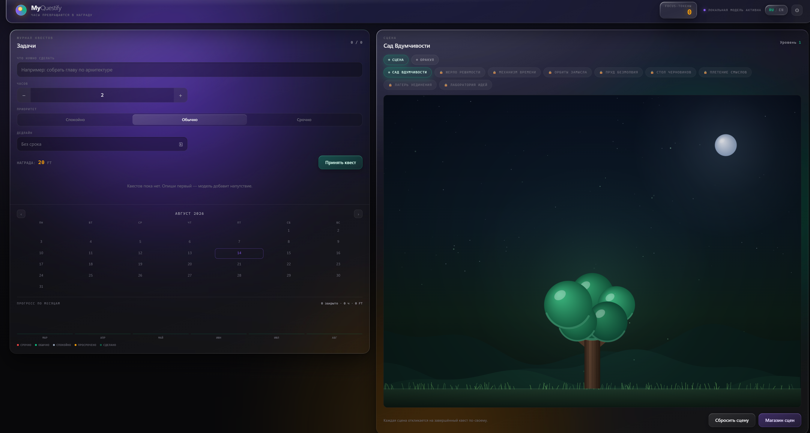
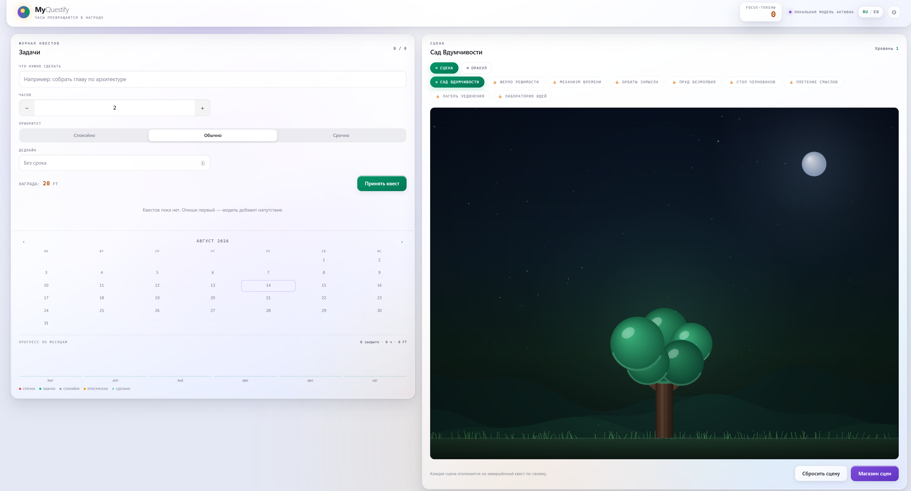
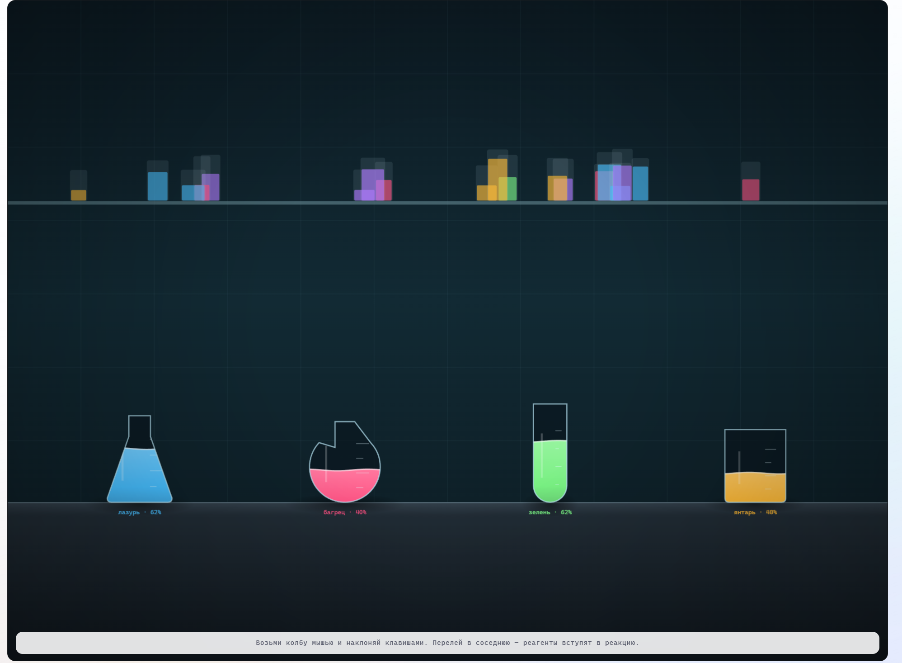
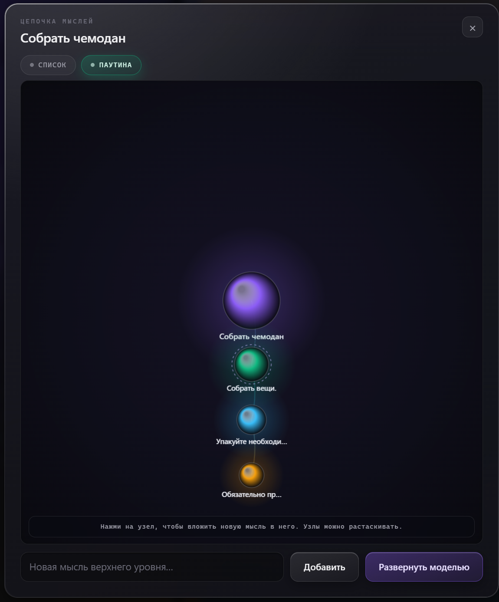
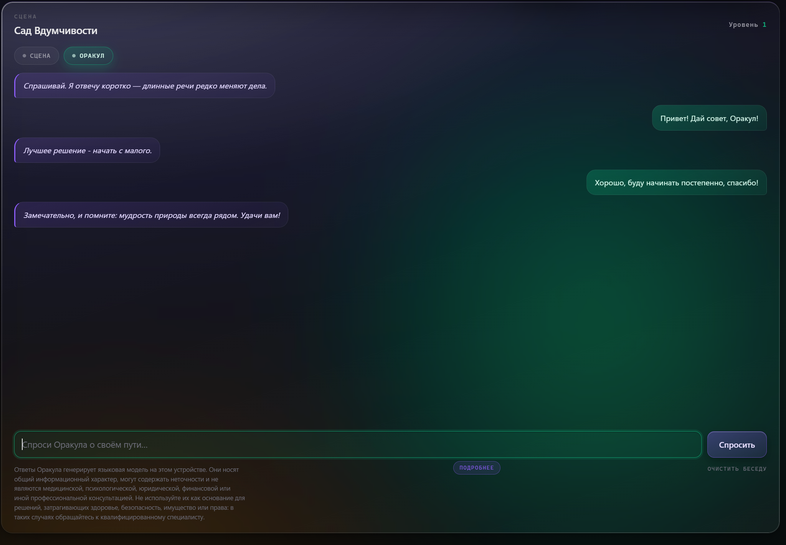
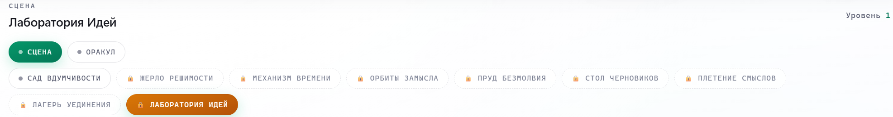
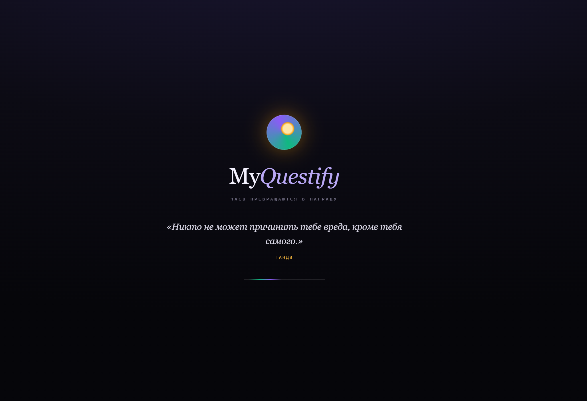
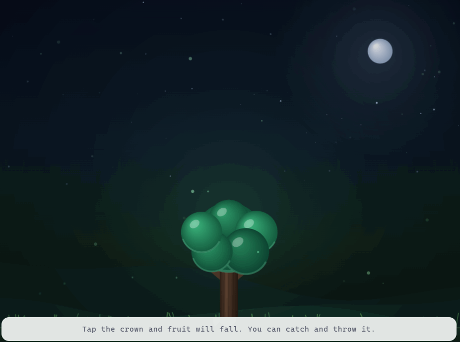
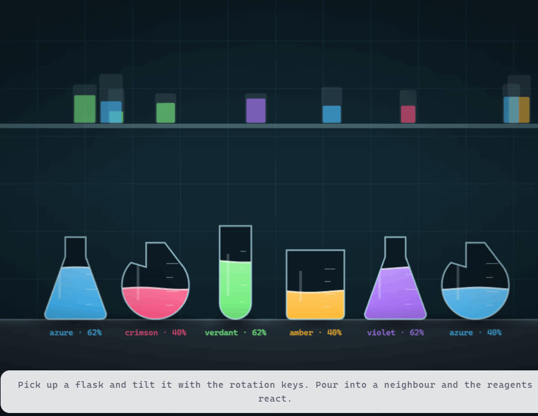

# MyQuestify

**Геймифицированный таск-трекер для рабочего стола, работающий полностью
офлайн.** Часы, заложенные в задачу, превращаются в награду; награда
открывает интерактивные сцены, с которыми можно возиться, пока думаешь над
следующим шагом.

Ни одного обращения к внешним службам: языковая модель выполняется на
процессоре пользователя, данные лежат в локальном файле SQLite, сервер
слушает только петлевой интерфейс.

<p align="center">
  
</p>

<p align="center">
  <a href="#стек"></a>
  <a href="#стек"></a>
  <a href="docs/MODEL.md"></a>
  <a href="LICENSE"></a>
</p>

## Что внутри

* **Квесты** с приоритетами, сроками и внутренней валютой. Просрочка стоит
  половины награды, но доделать работу с опозданием можно — запрет наказывал
  бы за ровно то поведение, к которому приложение должно подталкивать.
* **Цепочки мыслей** — разбор задачи на дерево шагов, как в аутлайнере, с
  двумя видами: вложенный список и граф-паутина.
* **Чат с Оракулом** — диалог с локальной языковой моделью в образе древнего
  мыслителя. Проверка безопасности выполняется детерминированным кодом до
  обращения к модели, а не полагается на системный промпт.
* **Девять интерактивных сцен** на собственном движке отрисовки поверх
  Matter.js: сад, вулкан, часовой механизм, солнечная система, пруд,
  рабочий стол, упругая сеть, костёр с моделью горения и химическая
  лаборатория со смешиванием реактивов.
* **Напоминания о сроках** приходят при свёрнутом окне: приложение уходит в
  область уведомлений и продолжает работать.
* **Две темы оформления** в стиле Liquid Glass, собственные элементы ввода
  вместо системных виджетов Windows.

## Как это выглядит

<table>
  <tr>
    <td width="50%">
      
      <p align="center"><sub>Светлая тема: стекло перестраивается, а не инвертируется</sub></p>
    </td>
    <td width="50%">
      
      <p align="center"><sub>Лаборатория Идей: восемь реакций между пятью реактивами</sub></p>
    </td>
  </tr>
  <tr>
    <td width="50%">
      
      <p align="center"><sub>Цепочка мыслей в виде графа</sub></p>
    </td>
    <td width="50%">
      
      <p align="center"><sub>Диалог с локальной моделью</sub></p>
    </td>
  </tr>
  <tr>
    <td width="50%">
      
      <p align="center"><sub>Девять сцен, открываются за внутреннюю валюту</sub></p>
    </td>
    <td width="50%">
      
      <p align="center"><sub>Двадцать изречений, случайное при каждом запуске</sub></p>
    </td>
  </tr>
</table>

## Сцены в движении

Статичный кадр не передаёт главного: сцены отзываются на действия и живут
собственной жизнью между ними.

<p align="center">
  
  <br>
  <sub>Сад Вдумчивости — нажатие на крону роняет плоды, их можно ловить и бросать</sub>
</p>

<table>
  <tr>
    <td width="50%">
      
      <p align="center"><sub>Лаборатория Идей: наклон колбы и реакция</sub></p>
    </td>
    <td width="50%">
      
      <p align="center"><sub>Лагерь Уединения: искры и ветер от руки</sub></p>
    </td>
  </tr>
</table>

## Стек

Python 3.10+ · FastAPI · SQLAlchemy · SQLite · PyWebView · llama-cpp-python ·
Matter.js · Vanilla JS · PyInstaller

---

## Быстрый старт из исходников

```powershell
python -m venv .venv
.\.venv\Scripts\Activate.ps1
pip install -r requirements.txt
python run.py
```

Приложение запустится и будет работать полностью. Языковая модель на этом
шаге не подключается: вместо генерации показываются заготовленные фразы, а
в шапке отображается «модель не найдена».

### Подключение языковой модели (необязательно)

```powershell
pip install -r requirements-llm.txt --extra-index-url https://abetlen.github.io/llama-cpp-python/whl/cpu
```

Пакет вынесен в отдельный файл намеренно. Он собирается из исходных текстов
и требует компилятор; при включении в общий список его неудачная установка
прерывала бы установку всего остального, и приложение не запускалось бы
вовсе. Указанный адрес отдаёт готовые сборки, поэтому компилятор не нужен.

После установки пакета в каталог `models` кладётся файл весов под именем
`model.gguf` — подробности в [docs/MODEL.md](docs/MODEL.md).

## Выпуски

```powershell
.\tools\make_release.ps1              # лёгкий, около 40 МБ
.\tools\make_release.ps1 -WithModel   # с моделью, около 1.2 ГБ
```

Готовые архивы появятся в каталоге `release`. Лёгкий выпуск подходит для
быстрой загрузки, полный работает сразу после распаковки — без установки и
без сети.

Модель кладётся рядом с приложением, а не встраивается внутрь: приложение
переносит её в каталог данных при первом запуске. Встраивание заставляло бы
распаковывать гигабайт при каждом открытии.

Сборка для Android описана в [mobile/README.md](mobile/README.md).

## Сборка .exe

```powershell
.\build_windows.ps1
```

Результат: `dist\MyQuestify.exe` — один файл, запускается двойным кликом.

| Флаг | Что делает |
|---|---|
| `-NoLlm` | собрать без llama-cpp-python, легче на 100–300 МБ |
| `-OneDir` | собрать каталогом: стартует быстрее, нет распаковки во временную папку |
| `-SkipInstall` | пропустить установку зависимостей при повторной сборке |

Скрипт вызывает `pyinstaller MyQuestify.spec`; spec можно запускать и напрямую.

---

## Документация

| Файл | О чём |
|---|---|
| `mobile/README.md` | сборка версии для Android и её отличия |
| `docs/DEFENSE.md` | что подготовить к защите и что делать при сбое |
| `mobile/README.md` | сборка версии для Android и её отличия |
| `docs/MODEL.md` | подключение любой локальной модели, форматы промпта, диагностика |
| `docs/THIRD-PARTY.md` | лицензии зависимостей, обработка данных, правовые оговорки |

Модель проекта — **Vikhr-Qwen-2.5-1.5B-Instruct** (Q4_K_M):
<https://huggingface.co/Vikhrmodels/Vikhr-Qwen-2.5-1.5B-Instruct-GGUF>

Приложение работает с любым GGUF: формат промпта (ChatML, Llama 3, Mistral,
Gemma, Alpaca) определяется автоматически по метаданным файла, а при их
отсутствии — по имени. Ничто в коде не привязано к конкретным весам.

---

## Что нужно положить руками

| Файл | Куда (из исходников) | Куда (собранный .exe) | Обязателен |
|---|---|---|---|
| `matter.min.js` | `static/js/vendor/` | попадает внутрь .exe при сборке | да — иначе сад покажет заглушку |
| `model.gguf` | `models/` | `%LOCALAPPDATA%\MyQuestify\models\` | нет — иначе резервные фразы |

Оба каталога содержат README с подробностями. Приложение стартует и без этих
файлов, честно показывая статус в шапке.

---

## Где лежат данные

| Режим | Каталог данных |
|---|---|
| `python run.py` | корень проекта |
| `MyQuestify.exe` | `%LOCALAPPDATA%\MyQuestify` |

Там: `myquestify.db`, `myquestify.log`, `uploads/`, `models/`.

Внутри `.exe` писать некуда: PyInstaller распаковывает ресурсы во временную
папку, доступную только на чтение и стираемую при выходе. Поэтому пути в
`app/config.py` разделены на `RESOURCE_DIR` (ресурсы сборки) и `DATA_DIR`
(профиль пользователя). Удалить каталог данных — то же, что сбросить прогресс.

---

## Интерактивные сцены и магазин

| Сцена | Цена | Механика |
|---|---|---|
| Сад Вдумчивости | бесплатно | клик по кроне роняет плоды; их ловят и бросают |
| Жерло Решимости | 300 FT | долгое нажатие на кратер запускает поток лавы, капли остывают на склоне |
| Механизм Времени | 450 FT | сцепленные шестерни: передаточное отношение обратно радиусам, малая еле проворачивает большую |
| Орбиты Замысла | 600 FT | планеты держат орбиту; перетаскивание на чужую меняет их местами |
| Пруд Безмолвия | 750 FT | архимедова плавучесть кувшинок, волна как цепочка связанных пружин |
| Стол Черновиков | 900 FT | предметы расшвыриваются, клик по пустому месту толкает всё рядом |
| Лаборатория Идей | 2000 FT | колбы с растворами: взять мышью, наклонить клавишами, перелить — цвета смешаются по объёму |
| Плетение Смыслов | 1200 FT | упругая сеть с отталкиванием узлов, глитч при сильном натяжении |
| Лагерь Уединения | 1500 FT | модель горения: поленья несут запас топлива, костёр угасает и разгорается, ветер от руки клонит пламя |

Механизм, Орбиты и Плетение считают динамику сами: зацепление шестерён и
упругая сеть выражаются несколькими строками математики, тогда как через
тела и связи Matter пришлось бы бороться с дрейфом и проскальзыванием.

Уровень влияет на каждую сцену: дерево крупнее, поток лавы плотнее, орбит
больше, на столе прибавляется предметов.

Кнопка «Сбросить сцену» возвращает текущую сцену в исходное состояние.
Объект сцены пересоздаётся из реестра, а не сбрасывается по полям: сброс
полей потребовал бы от каждой сцены помнить полный перечень своего
состояния, и любое забытое поле оставляло бы след прошлого сеанса —
разбросанные предметы, прогоревшие поленья, смешанные растворы.

Все четыре сцены видны вкладками над холстом: запертые помечены замком.
Клик по запертой открывает **бесплатный предпросмотр**: сцена монтируется на
клиенте, сервер о ней не знает, токены не списываются. Предпросмотр —
только просмотр: сцена живёт и рисуется, но не отвечает на мышь, иначе
покупка ничего бы не добавляла. Иначе цена назначалась бы вслепую: пользователь не видит, за что
платит. Покупка сохраняет сцену насовсем. Ключи сцен (`garden`,
`volcano`, `cosmos`, `desk`) хранятся в БД, поэтому переименовывать их нельзя —
только добавлять новые в `app/config.py` и `static/js/scenes.js`.

### Как устроен рендер

Штатный `Matter.Render` не используется: он умеет только плоскую заливку тел.
Физика и рисование разделены — Matter считает динамику, `static/js/stage.js`
рисует кадр вручную по 2D-контексту с градиентами, контактными тенями и
свечением, с масштабированием под `devicePixelRatio`.

Перетаскивание тоже своё, а не `MouseConstraint`: штатный захватывает любое
тело под курсором, включая статичную декорацию, из-за чего клики по сцене не
доходили до обработчика. Ядро сначала ищет тело среди «перетаскиваемых»
(с допуском в 26 px, иначе мелкие объекты почти не поймать), и только если не
нашло — отдаёт клик сцене.

---

## Цепочка мыслей

Каждый квест разбирается на дерево шагов произвольной вложенности — как
аутлайнер в Obsidian. Два вида:

* **Список** — вложенный аутлайнер. Клик по тексту правит его на месте,
  «+» открывает поле для своего подшага, ✦ просит у модели три конкретных
  шага, «×» удаляет узел с поддеревом (в два нажатия).
* **Паутина** — граф: квест в центре, шаги расходятся кольцами по уровням.
  Узлы растаскиваются мышью, связи тянутся за ними.

Раскладка паутины радиальная, а не силовая: силовой алгоритм каждый раз даёт
новую картинку, и пользователь теряет узнавание собственного плана. Сектор
поддерева пропорционален числу его листьев — иначе ветка с десятью шагами
слиплась бы в кашу рядом с веткой из одного.

Узлы, предложенные моделью, помечены и в списке, и в паутине: свои
формулировки должны быть отличимы от машинных, иначе цепочка перестаёт быть
планом пользователя.

Дерево хранится ссылкой на родителя, а не вложенным JSON: узел меняется одним
запросом, без переписывания цепочки целиком.

### Диалоги браузера не используются

`window.prompt`, `window.confirm` и `window.alert` встроенный WebView2
блокирует — вызов молча возвращает отказ, и действие не срабатывает. Поэтому
во всём приложении их нет: ввод идёт полем прямо в строке узла, а любое
необратимое действие (удаление мысли, очистка беседы) подтверждается вторым
нажатием на ту же кнопку.

### Ответы без тела

Маршруты, отвечающие `204 No Content`, FastAPI отдаёт с заголовком
`application/json` и пустым телом. `response.json()` на таком ответе падает с
«Unexpected end of JSON input», из-за чего удаление беседы и мысли не
срабатывали. Клиент читает тело как текст и разбирает его сам.

---

## Чат с Оракулом

Диалог с локальной моделью в образе древнего мыслителя: короткие ответы,
мягкое возвращение к посильному шагу.

**Безопасность не доверена модели.** Полуторамиллиардная модель следует
системному промпту нестабильно и нарушит запрет при настойчивой формулировке.
Поэтому в `app/oracle_safety.py` стоит детерминированный фильтр, который
работает **до** генерации и не зависит от модели вообще:

| Вердикт | Когда | Что происходит |
|---|---|---|
| `CRISIS` | признаки мыслей о самоповреждении | образ Оракула снимается — витиеватая речь в такой момент звучит как отстранённость; ответ прямой, тёплый, с предложением обратиться к живому человеку |
| `HARMFUL` | просьба, ведущая к вреду или нарушению закона | мягкий отказ и перевод разговора к тому, что за просьбой стоит |
| `ALLOW` | обычный разговор | идёт в модель |

Сгенерированный ответ проверяется вторично: модель может свернуть в опасную
тему сама, даже если вопрос был безобидным. Списки намеренно грубые — ложное
срабатывание стоит одного неловкого ответа, пропуск дороже.

---

## Напоминания и фоновая работа

Планировщик внутри серверного процесса просыпается раз в минуту, находит
квесты с приближающимся сроком, просит модель сочинить короткую фразу и
показывает всплывающее уведомление Windows.

**Как это работает при закрытом окне.** Закрытие сворачивает приложение в
трей: процесс продолжает жить, планировщик работает. Полный выход — через
меню значка. Честная граница: пока процесс не запущен вообще (перезагрузка,
выход через меню), напоминаний нет — независимая доставка потребовала бы
задачи в «Планировщике заданий» Windows, а это отдельная установка.

Если `pystray` или `Pillow` не установлены, трей отключается, приложение
работает как раньше, а напоминания уходят в журнал.

---

## Тема оформления

Светлый режим устроен зеркально тёмному, а не инверсией цветов: белое стекло
на белом фоне исчезло бы. На светлом заливка панели становится плотнее фона,
кромка тоньше, а за отрыв от подложки отвечают внешние тени вместо внутренней
подсветки. Акценты приглушены — те же значения на светлом бьют по глазам.

Тема, напоминания и «меньше движения» хранятся в БД, а не в localStorage:
тема должна применяться в первом же кадре после запуска `.exe`, а планировщик
живёт на сервере и о браузерном хранилище ничего не знает.

Сцены остаются тёмными в обеих темах: физика рисуется собственными
градиентами, и светлый холст потребовал бы второго набора палитр.

---

## Экономика

| Событие | Эффект |
|---|---|
| Создание задачи | фиксируется награда `часы × 10` |
| Завершение задачи | начисляются токены, пересчитывается уровень дерева |
| 3 завершённые задачи | +1 уровень дерева (потолок — 10) |

Награда хранится в самой задаче: изменение тарифа в конфиге не переоценивает
задним числом уже созданные задачи.

---

## Проверка перед запуском

```powershell
node tools/smoke_test.js
```

Скрипт поднимает минимальную замену DOM, загружает клиентские файлы в том
же порядке, что и страница, и убеждается, что запуск доходит до конца.
Синтаксическая проверка таких ошибок не находит: пропущенное объявление
функции проявляется только во время выполнения и приводит к самому
неприятному отказу — приложение открывается, показывает экран загрузки и
остаётся на нём навсегда, ничего не выводя ни в журнал сервера, ни на
страницу.

## Структура

```
run.py                    PyWebView + uvicorn, адаптация под Windows
tray_icon.py              значок в трее и всплывающие уведомления
MyQuestify.spec          спецификация PyInstaller
build_windows.ps1         сборка .exe одной командой
requirements.txt
app/
  config.py               пути (ресурсы / данные), тарифы, лимиты
  models.py               ORM: users / tasks / garden
  database.py             async engine, сессии, init_db
  schemas.py              Pydantic-контракты API
  ai_module.py            llama-cpp-python: ленивая загрузка, CPU, фолбэк
  prompt_formats.py       шаблоны разметки диалога и их автоопределение
  oracle_safety.py        детерминированный фильтр перед моделью
  notifier.py             планировщик напоминаний о дедлайнах
  logging_setup.py        логирование без консоли (windowed-режим)
  main.py                 FastAPI: маршруты и бизнес-логика
static/
  css/style.css           тёмная тема, Liquid Glass, grid
  js/app.js               API-слой, магазин, рендер UI
  js/stage.js             ядро сцен: холст, кадры, ввод, перетаскивание
  js/scenes.js            четыре сцены: сад, вулкан, космос, стол
  js/thoughtweb.js        паутина рассуждений: граф цепочки мыслей
  js/vendor/              matter.min.js (вендорится вручную)
  favicon.svg
templates/index.html
tools/make_icon.py        генерация assets/icon.ico
tools/make_release.ps1    сборка выпусков для публикации
tools/smoke_test.js       проверка запуска интерфейса без браузера
tools/make_android_icons.py  значки приложения для Android
static/js/local-api.js    серверная логика для работы без Python
static/js/touch-controls.js  экранные кнопки поворота
static/js/mobile-notify.js   напоминания средствами устройства
mobile/                   сборка для Android на Capacitor
static/js/local-api.js    серверная логика для работы без Python
mobile/                   сборка для Android на Capacitor
assets/icon.ico           иконка приложения (генерируется)
```

---

## API

| Метод | Путь | Назначение |
|---|---|---|
| GET | `/` | UI приложения |
| GET | `/api/tasks/` | список задач |
| POST | `/api/tasks/` | создать задачу + сгенерировать фразу |
| PATCH | `/api/tasks/{id}/complete` | завершить, начислить токены |
| GET | `/api/garden/` | состояние сада и баланс |
| GET | `/api/shop/` | витрина сцен с отметками о покупке |
| POST | `/api/shop/{key}/purchase` | купить сцену, списать токены |
| PATCH | `/api/garden/scene/{key}` | переключить активную сцену |
| GET | `/api/tasks/{id}/thoughts` | дерево цепочки мыслей |
| POST | `/api/tasks/{id}/thoughts` | добавить узел |
| POST | `/api/tasks/{id}/thoughts/expand` | развернуть узел моделью |
| PATCH | `/api/thoughts/{id}` | изменить текст или отметку |
| DELETE | `/api/thoughts/{id}` | удалить узел с поддеревом |
| GET/POST/DELETE | `/api/oracle/` | история, вопрос, очистка беседы |
| GET/PATCH | `/api/settings/` | тема, напоминания, движение |
| GET | `/api/health` | режим запуска, наличие весов, путь к данным |

Статика раздаётся двумя точками: `/static` — ресурсы сборки, `/media` —
загруженные фоны из каталога данных. В БД хранится только имя файла, URL
собирается на лету — база остаётся переносимой между платформами.

Интерактивная документация: `/docs` при запущенном приложении.

---

## Адаптация под Windows

| Что | Зачем |
|---|---|
| `multiprocessing.freeze_support()` | без него `.exe` при создании дочернего процесса перезапускает сам себя |
| `SetProcessDpiAwareness` | при масштабе 125/150 % интерфейс иначе размывается |
| Именованный мьютекс | вторая копия не пишет в ту же БД и не открывает второе окно |
| `gui='edgechromium'` | автовыбор мог подставить устаревший MSHTML без `backdrop-filter` |
| Проверка WebView2 Runtime | иначе окно открывается пустым и чёрным без единой ошибки |
| `MessageBoxW` для ошибок | в windowed-сборке нет консоли, `print` уходит в никуда |
| Логирование в файл | `sys.stderr` равен `None`, обычный `basicConfig` уронил бы процесс |
| `DB_PATH.as_posix()` | обратные слэши ломают разбор URL в SQLAlchemy |
| UPX отключён | ломает нативные DLL llama.cpp и провоцирует ложные срабатывания антивирусов |

---

## Задел под Android

Порт потребует замены только оболочки, не логики:

* `RESOURCE_DIR` / `DATA_DIR` уже разделены — на Android подставляется
  каталог приложения вместо `%LOCALAPPDATA%`;
* пути к фонам хранятся как имена файлов, а не абсолютные пути;
* фронтенд — обычная веб-страница без платформенных зависимостей;
* llama-cpp-python на ARM собирается отдельно, а модуль ИИ и так
  переживает своё отсутствие.

Заменить придётся `run.py` (PyWebView → WebView активности) и способ
доставки статики. Кандидаты на сборку: BeeWare/Briefcase либо Chaquopy
с нативной активностью.


---

## Экран загрузки

Показывается, пока подтягиваются задачи, сцена и настройки, и держится не
меньше секунды: на быстрой машине экран мигнул бы на сотню миллисекунд, и
пользователь заметил бы движение, но не успел прочитать мысль.

Двадцать цитат философов, случайная при каждом запуске, без повтора подряд —
две одинаковые фразы кряду читаются как поломка. Заголовок набран засечным
шрифтом: это единственное место в приложении, где он появляется, и контраст
с гротеском интерфейса делает вход событием, а не паузой.

---

## Собственные элементы ввода

`input[type=number]` рисует пару микроскопических системных стрелок, а
`datetime-local` открывает календарь Windows — оба выпадают из оформления и
не поддаются стилизации. В `static/js/controls.js` оба заменены своими:

* **степпер** — крупные кнопки «−/+», удержание ускоряет перебор;
* **календарь** — сетка месяца с понедельника, колёса часов и минут,
  быстрые действия «Без срока» и «Сегодня 21:00».

Оба работают поверх скрытого нативного поля в том же формате значения,
поэтому остальной код не изменился.


---

## Приоритеты и штрафы

| Приоритет | Награда | Штраф за срыв |
|---|---|---|
| Спокойно | ×0.8 | половина награды |
| Обычно | ×1 | половина награды |
| Срочно | ×1.5 | половина награды |

Приоритет задаёт множитель награды. На штраф он влияет косвенно: штраф —
доля от награды, поэтому у срочного квеста он выше в те же полтора раза.
Отдельный множитель штрафа делал бы разницу четырёхкратной и подталкивал
занижать приоритет ради безопасности.

**Просроченный квест можно завершить.** Штраф удержан отдельно, награда
начисляется полностью, и суммарно опоздавший получает половину. Для квеста
на 8 часов обычного приоритета: вовремя +80 FT, с опозданием +40 FT,
брошенный −40 FT. Обход невыгоден, а попытка доделать работу не наказывается.

Отсрочка в 15 минут спасает от штрафа за минуту опоздания. Баланс не уходит
в минус: долговая яма не мотивирует, а отбивает желание открывать приложение.

Правило применяют и маршрут `/api/tasks/sweep_overdue` (при запуске
интерфейса), и фоновый планировщик — код общий, иначе баланс зависел бы от
того, открыто ли окно.

## Правка и удаление квестов

Кнопки появляются на карточке при наведении. Завершённый квест не
редактируется: награда за него начислена, и правка оценки задним числом
рассогласовала бы баланс с историей.

При переносе срока в будущее снимается статус провала и отметка об
отправленном напоминании — перенос это осознанное решение продолжить
работу. Уже удержанные токены при этом не возвращаются.

Удаление уносит цепочку мыслей квеста и пересчитывает уровень сцены.
Начисленные и удержанные токены не пересчитываются: баланс отражает
совершённые действия.

## Прогресс по месяцам

Столбчатая диаграмма под календарём. Высота столбца — доля доведённых до
конца среди закрытых квестов, насыщенность — абсолютное их число: месяц с
единственным выполненным квестом не должен выглядеть так же убедительно,
как месяц с двадцатью.

Квест относится к месяцу по дате завершения, а для незакрытых — по дате
создания. Привязка всех к дате создания исказила бы картину: квест,
заведённый в марте и закрытый в апреле, — это результат апреля.


## Календарь квестов

Месячная сетка под списком: точка на дне — цвет по приоритету, оранжевая
для просроченных. Клик по дню прокручивает список к нужному квесту.

Данные берутся из уже загруженного списка, а не отдельным запросом: список
и календарь обязаны показывать одно и то же, а два источника рано или
поздно разойдутся.


---

## Лаборатория Идей

Пять реагентов и восемь реакций. Смешивание пары даёт продукт и видимый
эффект: пену, дым, вспышку, кристаллы или кипение. Ключ реакции строится из
отсортированной пары, поэтому порядок смешивания не влияет на результат —
иначе пользователь решил бы, что реакции случайны.

| Смесь | Результат | Эффект |
|---|---|---|
| янтарь + лазурь | зелень | пена |
| багрец + зелень | пепел | дым |
| янтарь + фиалка | багрец | вспышка |
| лазурь + зелень | жемчуг | кристаллы |
| багрец + фиалка | фиалка | кипение |

Физика своя, без Matter: жидкость здесь не набор тел, а объём с уровнем и
цветом. Через частицы движка пришлось бы держать сотни маленьких кругов ради
эффекта, который честно рисуется двумя дугами и линией среза, повёрнутой
против наклона колбы.

Смешение взвешено по объёму: капля в почти полную колбу едва меняет оттенок,
в пустую задаёт его целиком. Простое усреднение давало бы скачок цвета от
одной капли и читалось бы как ошибка.

Наклон — клавишами (по умолчанию Q и E: они лежат по разные стороны от W, поэтому наклон в две стороны ощущается симметрично; переназначаются в настройках).
Коды хранятся как `KeyboardEvent.code`, поэтому раскладка не влияет и на
кириллице сочетание не ломается.

## Подсказки к сценам

Строка под сценой гаснет через пять секунд и возвращается при переходе на
другую сцену: правила у каждой свои, и прочитанное однажды к новой не
относится. Полностью отключается в настройках.

Постоянная плашка перекрывала нижнюю часть кадра — ровно ту, где копятся
упавшие плоды и стекает лава.


---

## Выбор срока

Календарь не допускает момента в прошлом: прошедшие дни зачёркнуты и
недоступны, листание назад упирается в текущий месяц. Разряды времени
редактируются напрямую — можно вписать час и минуты цифрами, — и при вводе
уже прошедшего времени поля подсвечиваются, а кнопка «Готово» переносит
срок на следующий день.

Перенос вместо отказа выбран сознательно: отказ вынуждал бы подбирать
допустимое значение вслепую.

Переход по годам — двойными стрелками «« и »». Проверка повторяется перед
отправкой на сервер: значение поля может быть подставлено в обход
интерфейса, а квест с истёкшим сроком создавался бы сразу просроченным.

## Смена фона сцены

Функция удалена вместе с обработчиком загрузки файлов. Девять сцен
покрывают потребность в разнообразии, а неиспользуемый маршрут, принимающий
файлы, остаётся лишней поверхностью для ошибок.


---

## Лицензия

Исходный код распространяется по лицензии MIT — см. файл [LICENSE](LICENSE).

Сторонние библиотеки и языковая модель имеют собственные условия
использования; их перечень с примечаниями приведён в
[docs/THIRD-PARTY.md](docs/THIRD-PARTY.md).


---

## Два языка интерфейса

Переключатель в шапке меняет язык интерфейса и язык, на котором отвечает
модель, включая напоминания о сроках — они приходят при закрытом окне, и
язык для них берётся из базы, а не от клиента.

Строки разметки размечены атрибутами `data-i18n`, русский текст остаётся в
разметке и служит запасным значением: страница осмысленна ещё до выполнения
скриптов, а перевод сводится к подмене там, где она нужна.

### Проверка языка ответа

Модели, дообученные под один язык, отвечают на нём даже при инструкции на
другом — Vikhr-Qwen на английский промпт нередко отвечает по-русски. Поэтому
инструкция о языке дублируется в последней реплике пользователя (модели
следуют ближайшему к ответу указанию охотнее), а готовый ответ проверяется по
доле кириллицы. Ответ на чужом языке подменяется резервной фразой нужного:
осмысленный текст на неожиданном языке выглядит сбоем не меньше, чем
бессмыслица.
